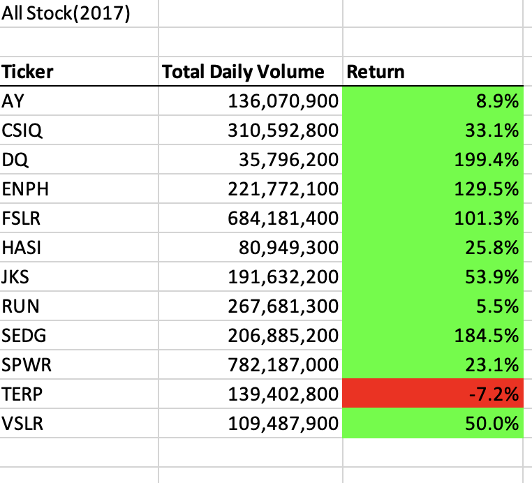
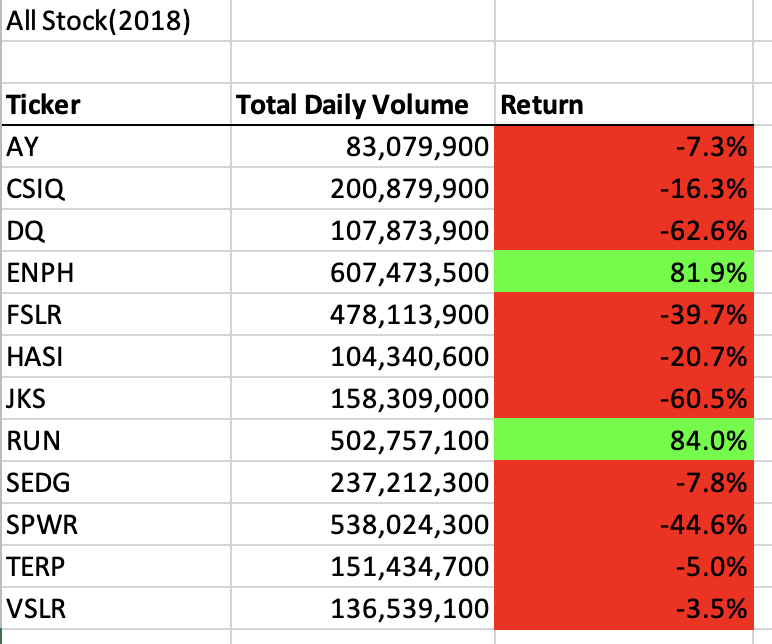
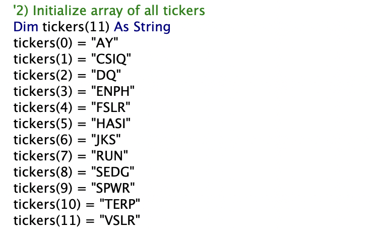
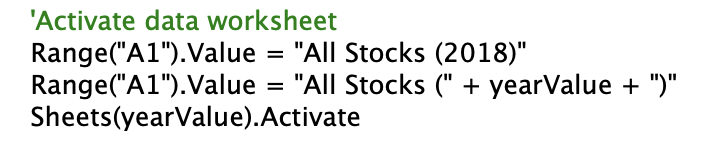
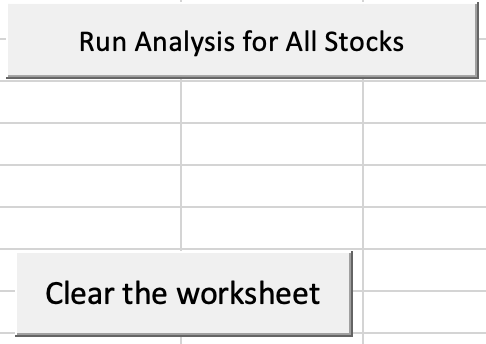
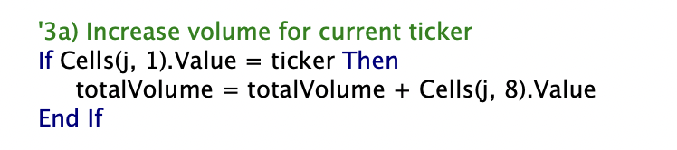

# stock-analysis.

## Overview of Project
### Background
Steve's parents wanted to invest all their money in an energy stock, but without enough research, so they asked Steve to help. Steve also requests to analyze various energy industry stocks to find the best way to diversify their funds.

### Purpose
This analysis used complex logic programming language(VBA) to calculate each tickers' annual return and total daily volume based on their historical data in 2017 and 2018.  

## Analysis
### Stock Performance
The screenshots below give information about 12 stocks performances within the energy industry in 2017 and 2018. The data indicate that all stocks had a positive return except TERP stock in 2017. However, only ENPH and RUN stock earned a positive return in 2018. Remarkably, only RUN stock dramatically increased from 2017 to 2018 from 5.5% to 84%.

### Execution Times Comparasion
After refactoring the code, I found the running speed became faster. The refactored script has six times faster than the original one in both two years.

2017 original compare to 2017 refactor
 

2018 original compare to 2018 refactor

### Advantages of refactored code:
1. Explicit comments help refactoring code is easy to read, understand and maintain later. Also, for facilitating subsequent stock analysis, Steve can simply add stock data for other industries.

2. search specific years by just clicking the macro button based on one refactored code. 

3. Set a loop to loop over all the rows by increasing the current volume in the code.

## Summary
### Advantage of refactored code
1. Improve code readability and reduce complexity to run the code faster.
2. The refactoring process is helpful for future maintenance or for adding new functions efficiently.

### Disadvantage of refactored code
1. As the number of track stock symbols increase, the number of arrays we create may affect the memory allocated to run macros. 
2. The procedure always needs to redesign, changed and delete many steps.

### How do these pros and cons apply to refactoring the original VBA script?
First, think about whether our code is easy for people to understand with a clear idea, logic, and comments. Second, is there a more efficient way of writing to make the code run faster, even when there is a lot of data？

If so, we need to refactor our code to make it cozier to process. 
